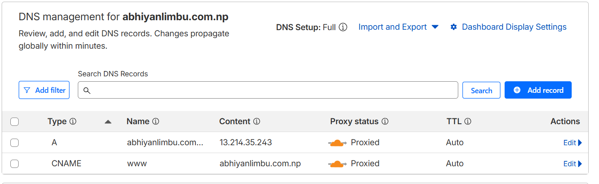
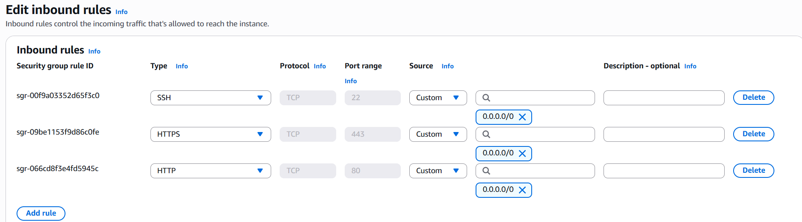
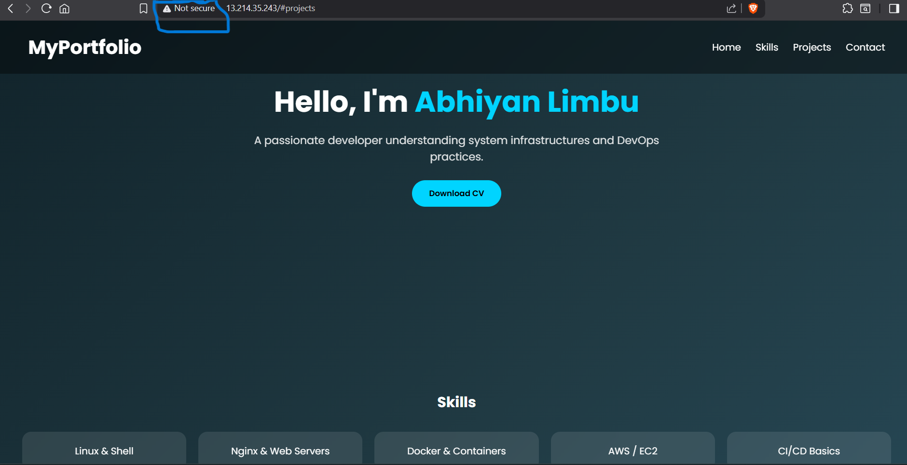
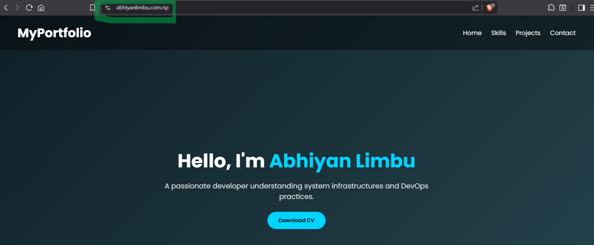

# Nginx Deployment Project on AWS EC2

## Overview

This project demonstrates deployment of a static website using Nginx on AWS EC2 with domain configuration and SSL setup.

## Project Structure

```
project/
├── nginx/
│   └── portfolio-web.conf
├── web/
│   ├── index.html
│   └── style.css
├── README.md
└── SSL_Setup_Guide.md
```

## Features

- Nginx web server setup
- Domain configuration with DNS
- SSL using Let's Encrypt

## Tech Stack

- AWS EC2
- Ubuntu
- Nginx
- Certbot (SSL)
- HTML/CSS

## Architecture

Domain → Nginx → Web Server (EC2)

## Setup Steps

1. Host EC2 Instances and make sure publci_ip is pointed towards your domaim
2. Install Nginx
3. Configure nginx folder conf file in /etc/nginx/sites-available
4. Enable site using symlink to sites-enabled and remove other files(optional)
5. Configure index and css file in /var/www/html/YourOwnFolderName/
6. Restart Nginx
7. Setup SSL using Certbot

## Deployment Steps

1.Install Nginx on your server

```
sudo apt update
sudo apt install nginx -y
```

2.Copy Web Files

```
sudo mkdir -p /var/www/html/portfolio-web
sudo cp -r web/* /var/www/html/portfolio-web/
```

3.Add Nginx Conf File

```
sudo cp nginx/portfolio-web.conf /etc/nginx/sites-available/
```

4.Enable Site

```
sudo ln -s /etc/nginx/sites-available/portfolio-web.conf /etc/nginx/sites-enabled/
```

5.Install SSL using [SSL_Setup_Guide](SSL_Setup_Guide.md)

6.Test & Reload Nginx

```
sudo nginx -t
sudo systemctl reload nginx
```

7. Run: https://www.yourdomain.com.np

Important Note:

- Ensure domain points to EC2 public IP
- Open ports 80 and 443 in security group
- SSL certificates expire every 90 days
- Never upload /etc/letsencrypt/ to GitHub

## Author

Abhiyan Limbu

# Cloudfare DNS



# AWS Security Groups



# Before HTTPS



# After HTTPS


